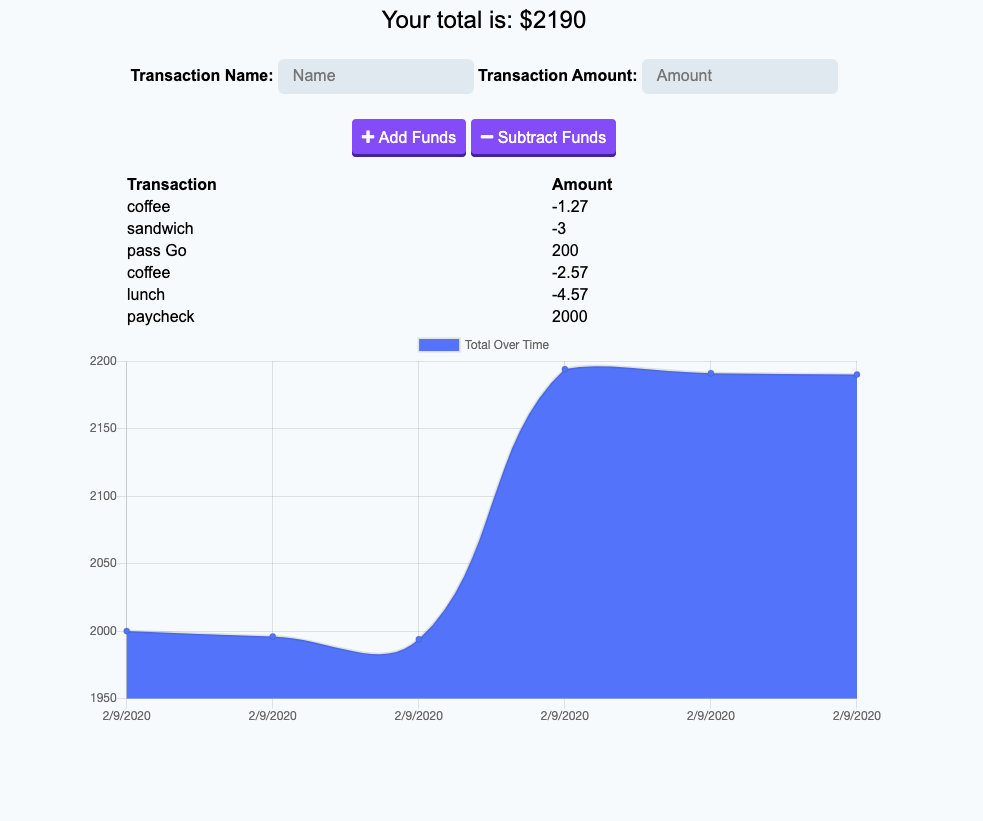

# budget-tracker
A progressive web application for tracking your budget.  

# Visuals

# Usage

* Navigate to https://warm-dusk-49647.herokuapp.com/
* Add funds to your budget
* Subtract funds from your budget
* Bugdet is represented with a graph
* App will continue to work when you are offline.  
* When you again have connectivity any changes will be synched with the MongoDB

# What I learned
* Working with a Progressive Web App
* Creating Service Worker and webmanifests
* MongoDB / Mongoose for DB CRUD

# Links to Project
#### GitHub
[budget-tracker](https://github.com/eric-gustafson1/budget-tracker)

#### Heroku
[budget-tracker](https://warm-dusk-49647.herokuapp.com/)
